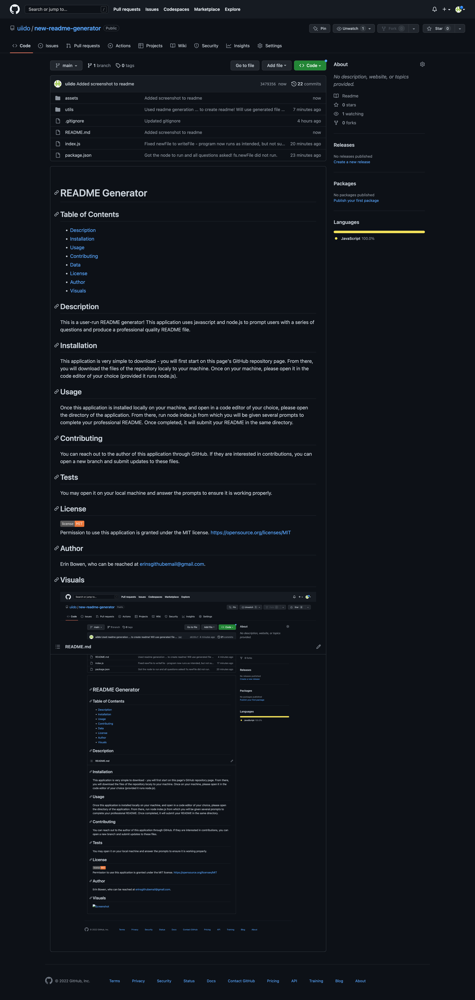

  # README Generator

## Table of Contents
- [Description](#description)
- [Installation](#installation)
- [Usage](#usage)
- [Contributing](#contributing)
- [Data](#tests)
- [License](#license)
- [Author](#author)
- [Visuals](#visuals)

## Description
This is a user-run README generator! This application uses javascript and node.js to prompt users with a series of questions and produce a professional quality README file.

## Installation
This application is very simple to download - you will first start on this page's GitHub repository page. From there, you will download the files of the repository localy to your machine. Once on your machine, please open it in the code editor of your choice (provided it runs node.js).

## Usage
Once this application is installed locally on your machine, and open in a code editor of your choice, please open the directory of the application. From there, run node index.js from which you will be given several prompts to complete your professional README. Once completed, it will submit your README in the same directory.

## Contributing
You can reach out to the author of this application through GitHub. If they are interested in contributions, you can open a new branch and submit updates to these files.

## Tests
You may open it on your local machine and answer the prompts to ensure it is working properly.

## License

 
Permission to use this application is granted under the MIT license. <https://opensource.org/licenses/MIT>

## Author
Erin Bowen, who can be reached at erinsgithubemail@gmail.com.

## Visuals

